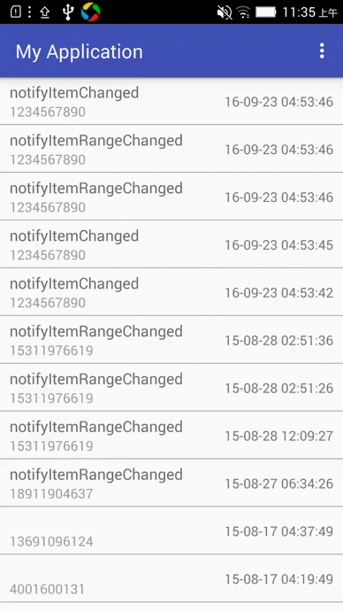
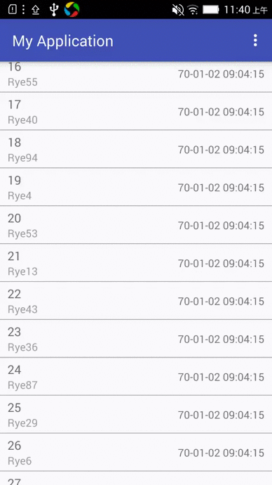

#RecyclerView  
It's a simple demo of RecyclerView. Moreover,it shows how to use RecyclerView to display a huge number of images.

##Screenshots


#RecyclerViewCursorAdapter  
It's a Adapter that exposes data from a Cursor to a RecyclerView.
##How to use?
RecyclerViewCursorAdapter is a abstract class, it's like [CursorAdapter](https://developer.android.com/reference/android/widget/CursorAdapter.html). For example:
```
public class MainAdapter extends RecyclerViewCursorAdapter {


    public MainAdapter(Cursor cursor) {
        super(cursor, false);
    }


    @Override
    public RecyclerView.ViewHolder onCreateViewHolder(ViewGroup parent, int viewType) {
        View view = LayoutInflater.from(parent.getContext()).inflate(R.layout.main_item, parent, false);
        return new ViewCache(view);
    }

    @Override
    public void onBindViewHolder(final RecyclerView.ViewHolder holder, Cursor cursor) {
        ViewCache viewCache = (ViewCache) holder;
        viewCache.nameView.setText(cursor.getString(0));
        viewCache.numberView.setText(cursor.getString(1));
        viewCache.dateView.setText(new SimpleDateFormat("yy-MM-dd hh:mm:ss").format(new Date(cursor.getLong(2))));
    }


    public static class ViewCache extends RecyclerView.ViewHolder {

        private TextView nameView;
        private TextView numberView;
        private TextView dateView;

        public ViewCache(View itemView) {
            super(itemView);

            nameView = (TextView) itemView.findViewById(R.id.call_logs_name);
            numberView = (TextView) itemView.findViewById(R.id.call_logs_number);
            dateView = (TextView) itemView.findViewById(R.id.call_logs_date);
        }
    }

}
```

If you want to refresh the UI when the data changes, you can call swapCursor(),swapCursorItemChanged(),swapCursorItemRangeChanged(),swapCursorItemInserted(),swapCursorItemRemoved(),swapCursorItemRangeRemoved(),or swapCursorItemMoved() method. Those are like notifyItemChanged(),notifyItemRangeChanged(),notifyItemInserted(),notifyItemRemoved(),notifyItemRangeRemoved(),and notifyItemMoved() method. However,you don't need to call them.

##Screenshots



